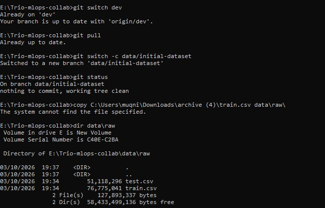
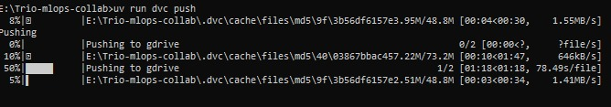
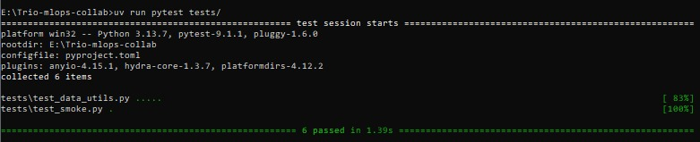
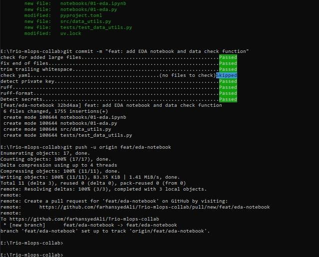
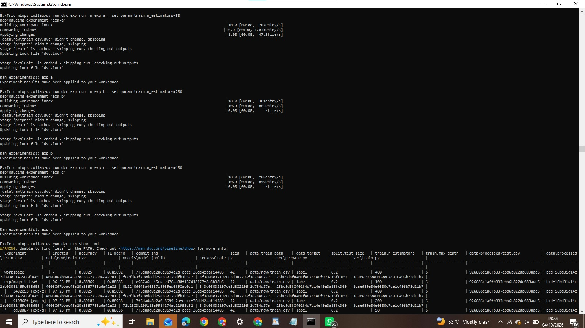
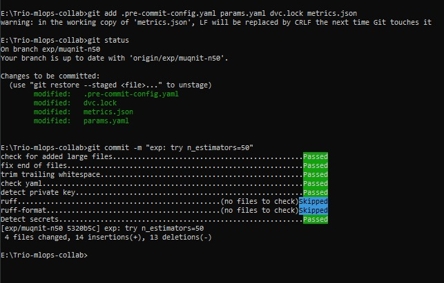

## Muqnit: contribution (Data owner)

I owned data versioning and the exploratory analysis, and I ran an experiment series on
the training pipeline. I set up a shared Google Drive folder as the DVC remote (own Google
Cloud OAuth client; credentials kept in `.dvc/config.local`, never in Git) and tracked the
Kaggle Digit Recognizer `train.csv` (about 77 MB, 784 pixel columns plus `label`) with DVC,
so Git stores only the `train.csv.dvc` pointer (PR #5). I built the EDA notebook
`notebooks/01-eda.ipynb`, paired with `01-eda.py` through jupytext, and moved
`check_digits_frame` into `src/data_utils.py` with 5 unit tests (PR #7). In Phase 7 I ran
three `dvc exp` runs on `train.n_estimators`, promoted the winner (400 trees) through
`feat/n-estimators-400` ([PR link]), and kept `exp/muqnit-n50` as an unmerged branch
([branch link]). I reviewed [list PRs with links, including the "changes requested" review].
[Data-update PR: link and what it changed.] [Release: reproduction test result.]

## Data versioning (DVC + Google Drive)

- Remote: shared Google Drive folder, accessed with `dvc[gdrive]`.
- Tracked file: `data/raw/train.csv` (pointer `data/raw/train.csv.dvc`; the CSV is not in Git history).
- Each teammate adds their own client ID and secret with `dvc remote modify --local`.
- Recovering an old data version: `git checkout <commit> -- data/raw/train.csv.dvc`, then `dvc checkout`.

**Evidence**

Branch `data/initial-dataset` created from `dev`; the dataset in `data/raw` (`train.csv` is 76,775,041 bytes):

`dvc push` uploading the data to the Google Drive remote:

[Add after the data-update PR: screenshot of `git checkout` + `dvc checkout` moving between the old and new row count.]

## Notebook and tested code (PR #7)

`notebooks/01-eda.ipynb` is paired with `notebooks/01-eda.py` (jupytext, percent format). The
reusable function `check_digits_frame` lives in `src/data_utils.py` and is imported by the
notebook; its 5 unit tests are in `tests/test_data_utils.py`.

The commit passes all pre-commit hooks and is pushed on `feat/eda-notebook` (6 files, including the
notebook, its `.py` pair, the helper and its tests):

## Experiments (n_estimators)

All runs used seed 42, `test_size` 0.2 and `max_depth` 6.

| Run | n_estimators | accuracy | f1_macro |
|---|---|---|---|
| exp-a | 50 | 0.88250 | 0.88056 |
| baseline | 100 | 0.88869 | 0.88685 |
| exp-b | 200 | 0.89107 | 0.88938 |
| **exp-c (winner)** | **400** | **0.89250** | **0.89092** |

Why exp-c won: it had the best accuracy and macro-F1. The gain over the baseline is small
(+0.0038 accuracy) and comes from one seed and one split, and 400 trees make the model larger
and slower to train.

The three runs and the `dvc exp show --md` comparison (the train and evaluate stages were
cached from an earlier attempt that failed while saving the experiment, see "What broke"):

## Abandoned branch: `exp/muqnit-n50`

50 trees underfit (accuracy 0.8825, below the 100-tree baseline of 0.88869), so the branch was
never merged and no PR was opened.

## What broke (for the retrospective)

- `/data/*` in `.gitignore` made DVC refuse to create `.dvc` pointer files. We removed it, because DVC writes its own `.gitignore` for the real CSV.
- The `detect-secrets` hook flagged the commit SHA in `metrics.json` as a secret, and pointed at a `.secrets.baseline` file that was not in the repo. We excluded `metrics.json` and dropped the baseline argument.
- `dvc exp run` failed on Windows (`WinError 2`) because a local `nbstripout` Git filter could not be launched by DVC. We removed the local filter.
- An old `pyopenssl` clashed with a new `cryptography` and broke `dvc push` to Google Drive. Fix: `uv add "pyopenssl>=24"`.
